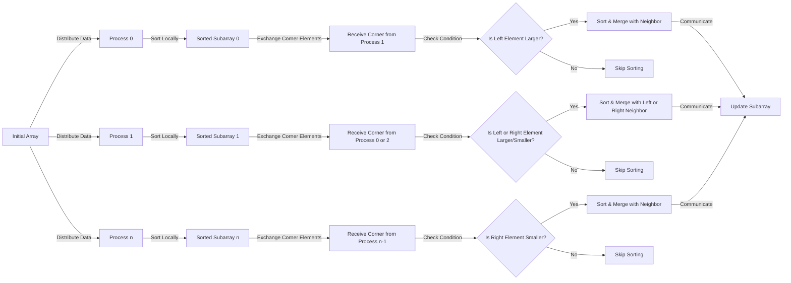

### CS542200 Parallel Programming
### Homework 1 Report: Parallel Odd-Even Sort using MPI
**Name:** 謝奕謀  
**Student ID:** 112065520

---

## 1. Implementation

### 1.1 Overview

This implementation performs a parallel **Odd-Even Sort** using MPI, distributing the total array size among available processes. Each process sorts its local subarray and communicates with neighbors to ensure global sorting.

#### Diagrams & Figures



### 1.2 Handling Input Items & Processes

- **Input Handling**: The total array size (`tot_arr_size`), input filename, and output filename are passed as command-line arguments.
- **Dynamic Process Management**: The program dynamically adjusts the number of active processes based on the total array size to prevent idle processes. The variable `size` represents the total number of processes, enabling even distribution of the array elements across ranks. The `rank` variable identifies the specific process and is crucial for managing the odd-even phase of sorting, where each rank coordinates with its neighboring ranks to perform local sorting and merging.

### 1.3 Sorting in the Program

The program uses an **Odd-Even Sort** algorithm in a parallel MPI-based implementation. The sorting process is carried out as follows:

1. **Local Sorting**:
- Each process sorts its local subarray independently using **Spreadsort**, a fast integer-based sorting algorithm.
- This ensures that each process starts with a sorted segment of the global array.

2. **Odd-Even Phases**:
- The global sorting is achieved through alternating **odd** and **even** phases, where each rank communicates with its neighboring ranks to exchange boundary elements.

    **Odd Phase**:
    - In the **odd phase**, odd-numbered ranks (e.g., 1, 3, 5, etc.) communicate with their left neighbor (rank - 1), while even-numbered ranks (e.g., 0, 2, 4, etc.) communicate with their right neighbor (rank + 1).

    - For **odd-numbered** ranks:
        - The **minimum element** of the current process’s subarray (`local_min`) is sent to the left neighbor.
        - The **maximum element** of the left neighbor is received.
        - If the received element is larger than the local minimum, merging is performed between the two subarrays to ensure the correct ordering.

    - For **even-numbered** ranks:
        - The **maximum element** of the local subarray (`local_max`) is sent to the right neighbor.
        - The **minimum element** of the right neighbor is received.
        - If the received element is smaller than the local maximum, merging is performed to maintain sorted order.

    **Even Phase**:
    - In the **even phase**, the communication pattern is reversed:
        - Even-numbered ranks (e.g., 0, 2, 4, etc.) communicate with their left neighbor (rank - 1), while odd-numbered ranks (e.g., 1, 3, 5, etc.) communicate with their right neighbor (rank + 1).

    - For **even-numbered** ranks:
        - The **minimum element** is sent to the left neighbor, and the **maximum element** of the left neighbor is received.
        - If necessary, merging is performed to maintain sorted order.

    - For **odd-numbered** ranks:
        - The **maximum element** is sent to the right neighbor, and the **minimum element** of the right neighbor is received.
        - Merging is done if required to ensure global order.

3. **Global Sorting Check**:

- After each phase (odd or even), a global check is performed to determine if the array is globally sorted.
- This is done using `MPI_Allreduce` to aggregate the status of each process. If all subarrays are locally sorted, the global sorting is complete. Using this method ensures early stopping rather than running the `for` loop for constant iterations.

4. **Writing to Output File**:

- Once the global sorting is achieved, each rank writes its portion of the sorted array back to the output file at its designated position.
- This ensures that the final output file contains the globally sorted array.

### 1.4 Source Code
```cpp=
#include <cstdio>
#include <cstdlib>
#include <mpi.h>
#include <algorithm>  // Needed for std::sort and std::merge
#include <boost/sort/spreadsort/spreadsort.hpp>  // For Boost Spreadsort

// Function to merge and sort two subarrays and keep their respective halves
void merge_and_split(float *left, int left_size, float *right, int right_size, float *tmp, int isLeftSubarray)
{
    int tmp_head = 0;
    int tmp_tail = 0;

    if (isLeftSubarray) {
        int left_ptr = 0;
        int right_ptr = 0;
        
        while (left_ptr < left_size) {
            // If something is inside tmp array, remember to check it first
            if (tmp_head != tmp_tail) {
                tmp[tmp_tail] = left[left_ptr];
                tmp_tail++;

                if (right_ptr < right_size) {
                    if (tmp[tmp_head] < right[right_ptr]) {
                        left[left_ptr] = tmp[tmp_head];
                        left_ptr++;
                        tmp_head++;
                    } else {
                        left[left_ptr] = right[right_ptr];
                        left_ptr++;
                        right_ptr++;
                    }
                } else {
                    left[left_ptr] = tmp[tmp_head];
                    left_ptr++;
                    tmp_head++;
                }
            // tmp array is empty, compare left and right array directly
            } else {
                if (right_ptr < right_size) {
                    if (left[left_ptr] < right[right_ptr]) {
                        left_ptr++;
                    } else {
                        tmp[tmp_tail] = left[left_ptr];
                        tmp_tail++;
                        left[left_ptr] = right[right_ptr];
                        left_ptr++;
                        right_ptr++;
                    }
                } else {
                    left_ptr++;
                }
            }
        }
    } else {
        int left_ptr = left_size - 1;
        int right_ptr = right_size - 1;

        while (right_ptr >= 0) {
            // If something is inside tmp array, remember to check it first
            if (tmp_head != tmp_tail) {
                tmp[tmp_tail] = right[right_ptr];
                tmp_tail++;

                if (left_ptr >= 0) {
                    if (tmp[tmp_head] > left[left_ptr]) {
                        right[right_ptr] = tmp[tmp_head];
                        right_ptr--;
                        tmp_head++;
                    } else {
                        right[right_ptr] = left[left_ptr];
                        right_ptr--;
                        left_ptr--;
                    }
                } else {
                    right[right_ptr] = tmp[tmp_head];
                    right_ptr--;
                    tmp_head++;
                }
            // tmp array is empty, compare left and right array directly
            } else {
                if (left_ptr >= 0) {
                    if (right[right_ptr] > left[left_ptr]) {
                        right_ptr--;
                    } else {
                        tmp[tmp_tail] = right[right_ptr];
                        tmp_tail++;
                        right[right_ptr] = left[left_ptr];
                        right_ptr--;
                        left_ptr--;
                    }
                } else {
                    right_ptr--;
                }
            }
        }
    }
}

int main(int argc, char **argv)
{
    int rank, size;

    MPI_Init(&argc, &argv);

    //int rank, size;
    MPI_Comm_rank(MPI_COMM_WORLD, &rank);
    MPI_Comm_size(MPI_COMM_WORLD, &size);

    // Read command line arguments
    int tot_arr_size = atoi(argv[1]); // Total size of the array
    char *input_filename = argv[2];   // Input file name
    char *output_filename = argv[3];  // Output file name

    // Adjust size if total array size is less than the number of processes
    if (tot_arr_size < size) {
        size = tot_arr_size;
    }

    // Calculate base array size and remainder
    int base_arr_size = tot_arr_size / size;
    int remainder = tot_arr_size % size;

    // Determine local array size for each rank
    int local_arr_size = base_arr_size + (rank < remainder ? 1 : 0);

    // Calculate the displacement for each rank's data in the input file
    int offset = rank * base_arr_size + std::min(rank, remainder);

    // Allocate local subarray
    float *data = (float *)malloc(sizeof(float) * local_arr_size);

    // Allocate memory for neighbor's data (maximum possible size)
    int max_neighbor_size = base_arr_size + (remainder > 0 ? 1 : 0);
    float *neighbor_data = (float *)malloc(sizeof(float) * max_neighbor_size);

    // Allocate tmp subarray to place elements when comparing
    float *tmp = (float *)malloc(sizeof(float) * (local_arr_size + max_neighbor_size));

    // Open the input file and read the subarray for this process
    MPI_File input_file, output_file;
    MPI_File_open(MPI_COMM_WORLD, input_filename, MPI_MODE_RDONLY, MPI_INFO_NULL, &input_file);

    if (rank < size) {
        // Read data from the file at the calculated offset
        MPI_File_read_at(input_file, sizeof(float) * offset, data, local_arr_size, MPI_FLOAT, MPI_STATUS_IGNORE);

        // Initial local sorting using Boost Spreadsort
        boost::sort::spreadsort::spreadsort(data, data + local_arr_size);
    }

    MPI_File_close(&input_file);

    int global_sorted = (size == 1) ? 1 : 0;

    while (!global_sorted)
    {
        int local_sorted = 1; // Assume local subarray is sorted
        float local_min = data[0];                      // Smallest element in this process
        float local_max = data[local_arr_size - 1];     // Largest element in this process
        float neighbor_min, neighbor_max;
        int neighbor_size;

        if (rank < size) {
            // Odd phase
            if (rank % 2 == 1 && rank - 1 >= 0)
            {
                // Exchange boundary elements with left neighbor
                MPI_Sendrecv(&local_min, 1, MPI_FLOAT, rank - 1, 0,
                            &neighbor_max, 1, MPI_FLOAT, rank - 1, 0, MPI_COMM_WORLD, MPI_STATUS_IGNORE);

                // Check if merging is needed
                if (local_min < neighbor_max)
                {
                    // Send local array size and receive neighbor's array size
                    MPI_Sendrecv(&local_arr_size, 1, MPI_INT, rank - 1, 0,
                                &neighbor_size, 1, MPI_INT, rank - 1, 0, MPI_COMM_WORLD, MPI_STATUS_IGNORE);

                    // Exchange subarrays
                    MPI_Sendrecv(data, local_arr_size, MPI_FLOAT, rank - 1, 0,
                                neighbor_data, neighbor_size, MPI_FLOAT, rank - 1, 0, MPI_COMM_WORLD, MPI_STATUS_IGNORE);

                    // Perform merging
                    merge_and_split(neighbor_data, neighbor_size, data, local_arr_size, tmp, 0);
                    local_sorted = 0; // Set flag if merging was done
                }
            }
            else if (rank % 2 == 0 && rank + 1 < size)
            {
                // Exchange boundary elements with right neighbor
                MPI_Sendrecv(&local_max, 1, MPI_FLOAT, rank + 1, 0,
                            &neighbor_min, 1, MPI_FLOAT, rank + 1, 0, MPI_COMM_WORLD, MPI_STATUS_IGNORE);

                // Check if merging is needed
                if (local_max > neighbor_min)
                {
                    // Send local array size and receive neighbor's array size
                    MPI_Sendrecv(&local_arr_size, 1, MPI_INT, rank + 1, 0,
                                &neighbor_size, 1, MPI_INT, rank + 1, 0, MPI_COMM_WORLD, MPI_STATUS_IGNORE);

                    // Exchange subarrays
                    MPI_Sendrecv(data, local_arr_size, MPI_FLOAT, rank + 1, 0,
                                neighbor_data, neighbor_size, MPI_FLOAT, rank + 1, 0, MPI_COMM_WORLD, MPI_STATUS_IGNORE);

                    // Perform merging
                    merge_and_split(data, local_arr_size, neighbor_data, neighbor_size, tmp, 1);
                    local_sorted = 0; // Set flag if merging was done
                }
            }

            // Even phase
            if (rank % 2 == 0 && rank - 1 >= 0)
            {
                // Exchange boundary elements with left neighbor
                MPI_Sendrecv(&local_min, 1, MPI_FLOAT, rank - 1, 0,
                            &neighbor_max, 1, MPI_FLOAT, rank - 1, 0, MPI_COMM_WORLD, MPI_STATUS_IGNORE);

                // Check if merging is needed
                if (local_min < neighbor_max)
                {
                    // Send local array size and receive neighbor's array size
                    MPI_Sendrecv(&local_arr_size, 1, MPI_INT, rank - 1, 0,
                                &neighbor_size, 1, MPI_INT, rank - 1, 0, MPI_COMM_WORLD, MPI_STATUS_IGNORE);

                    // Exchange subarrays
                    MPI_Sendrecv(data, local_arr_size, MPI_FLOAT, rank - 1, 0,
                                neighbor_data, neighbor_size, MPI_FLOAT, rank - 1, 0, MPI_COMM_WORLD, MPI_STATUS_IGNORE);

                    // Perform merging
                    merge_and_split(neighbor_data, neighbor_size, data, local_arr_size, tmp, 0);
                    local_sorted = 0; // Set flag if merging was done
                }
            }
            else if (rank % 2 == 1 && rank + 1 < size)
            {
                // Exchange boundary elements with right neighbor
                MPI_Sendrecv(&local_max, 1, MPI_FLOAT, rank + 1, 0,
                            &neighbor_min, 1, MPI_FLOAT, rank + 1, 0, MPI_COMM_WORLD, MPI_STATUS_IGNORE);

                // Check if merging is needed
                if (local_max > neighbor_min)
                {
                    // Send local array size and receive neighbor's array size
                    MPI_Sendrecv(&local_arr_size, 1, MPI_INT, rank + 1, 0,
                                &neighbor_size, 1, MPI_INT, rank + 1, 0, MPI_COMM_WORLD, MPI_STATUS_IGNORE);

                    // Exchange subarrays
                    MPI_Sendrecv(data, local_arr_size, MPI_FLOAT, rank + 1, 0,
                                neighbor_data, neighbor_size, MPI_FLOAT, rank + 1, 0, MPI_COMM_WORLD, MPI_STATUS_IGNORE);

                    // Perform merging
                    merge_and_split(data, local_arr_size, neighbor_data, neighbor_size, tmp, 1);
                    local_sorted = 0; // Set flag if merging was done
                }
            }
        }

        // Check if all processes are globally sorted
        MPI_Allreduce(&local_sorted, &global_sorted, 1, MPI_INT, MPI_LAND, MPI_COMM_WORLD);
    }

    // Write the sorted subarray back to the output file
    MPI_File_open(MPI_COMM_WORLD, output_filename, MPI_MODE_CREATE | MPI_MODE_WRONLY, MPI_INFO_NULL, &output_file);

    if (rank < size) {
        // Calculate the displacement for each rank's data in the output file
        MPI_File_write_at(output_file, sizeof(float) * offset, data, local_arr_size, MPI_FLOAT, MPI_STATUS_IGNORE);
    }

    MPI_File_close(&output_file);

    // Free allocated memory
    free(data);
    free(neighbor_data);
    free(tmp);

    MPI_Finalize();

    return 0;
}
```

---

## 2. Experiment & Analysis

### 2.1 Methodology

**System Specifications(Using Apollo Cluster)**

- **CPU**: Intel Xeon X5670 @ 2.93 GHz, 24 cores (12 cores per socket, 2 sockets), 48 threads with Hyper-Threading.
- **RAM**: 96 GB DDR3.
- **Disk**: 7.3 TB NVMe SSD (954 GB free).
- **Network**: 40 Gbps InfiniBand for inter-node communication.

### 2.2 Test Case Description

The experiments were conducted using the testcase 35 with input size of 536,869,888 elements.

### 2.3 Experiment Configurations

#### (a) Single Node Experiments

- **Processes**: 1 ~ 12
- **Node Count**: 1
- **Description**: The test was performed on a single node with varying numbers of processes to observe the impact on execution time, I/O time, and communication time.
- **Results Visualization**:
    - Time Profile:
    

    - Speedup:
    


#### (b) Multiple Nodes Experiments

- **Processes**: 4 ~ 48 (Incrementing by the number of processes per node)
- **Node Count**: 4 nodes, with varying processes per node
- **Description**: The test was performed on 4 nodes with varying numbers of processes (4, 8, 16, 32, 48) to observe the impact on execution time, I/O time, and communication time.

- **Results Visualization**:
    - **Time Profile**:
    

    - **Speedup**:
    


## 3. Discussion and Conclusion

### Comparing I/O, CPU, and Network Performance

- **Single Node Observations**:
    - The CPU time is the dominant contributor to the total execution time, indicating that computation is a significant bottleneck.
    - I/O time remains consistent and is not a major bottleneck in this setup.
    - Communication time is relatively minor, suggesting limited network overhead within a single node.

- **Multi-Node Observations**:
    - CPU time reduces as the process count increases, showing benefits from parallelism.
    - Communication time increases significantly with more processes, indicating that network overhead becomes a bottleneck as more nodes are involved.
    - I/O time remains steady, implying that I/O scaling is adequate for the current setup.

### Bottlenecks and Improvement Recommendations

- **Primary Bottleneck**:
    - **Single Node**: CPU time is the main bottleneck. The choice of sorting algorithm greatly impacts the CPU performance. I experimented with different algorithms, including **Bubble Sort**, **Merge Sort**, and **Boost Sort**, to observe their effects:
        - **Bubble Sort**: While simple to implement, this algorithm was the least efficient, leading to significantly higher CPU time due to its quadratic time complexity `(O(n^2))`.
        - **Merge Sort**: This algorithm provided better performance with a time complexity of `(O(n \log n))`, reducing CPU time compared to Bubble Sort. However, its recursive nature and memory overhead had limitations in highly parallel settings.
        - **Boost Sort (Spreadsort)**: This sorting algorithm outperformed both Bubble Sort and Merge Sort due to its efficient handling of integer-based data, with a performance near linear `(O(n))` under favorable conditions. The use of **Boost Sort** resulted in the lowest CPU time in my tests.
    - **Multi-Node**: Network communication becomes a limiting factor as the number of processes increases.

- **Improvements**:
    - **CPU**:
        - Use more efficient sorting algorithms such as **Boost Sort** for better performance in parallel processing. The choice of sorting algorithm significantly impacts CPU time, so optimizing this choice can lead to notable improvements. I have also inspected `radix sort` and heard other classmates use the sorting algorithm, resulting in faster executing time.
    - **Network**:
        - Use non-blocking MPI functions (`MPI_Isend`, `MPI_Irecv`) for overlapping computation and communication.
        - Reduce communication frequency by aggregating messages.
    -  **I/O**:
        -  Optimize I/O operations with parallel I/O libraries like **MPI-IO** to handle large data volumes more efficiently and reduce the potential impact of I/O operations on the total execution time.

### Scalability Analysis

#### Single Node

- **Initial Scalability**: The program demonstrates strong scalability up to a certain number of processes, typically around 6 to 8 processes. This initial scalability gain is due to the efficient parallel distribution of tasks and the reduction in local sorting time as more cores are utilized.
- **Diminishing Returns**: Beyond 8 processes, the speedup curve starts to plateau, showing diminishing returns. This is primarily due to resource contention where processes begin to compete for shared memory and cache resources. The overhead of coordinating more processes also starts to counteract the benefits of parallelism.
- **Impact of Sorting Algorithm**: The choice of sorting algorithm is critical in determining how well the program scales:
  - **Bubble Sort** severely limits scalability due to its `( O(n^2))` complexity, leading to higher CPU time as the input size increases.
  - **Merge Sort**, with its `( O(n \log n))` complexity, shows better scalability but has limitations due to recursive calls and memory overhead.
  - **Boost Sort (Spreadsort)** provides the best results, as its near-linear performance allows for more consistent CPU time even as the number of processes increases. This efficiency translates to better scalability on a single node.

#### Multi-Node

- **Scalability Across Nodes**: The program exhibits scalability when transitioning from single-node to multi-node environments, particularly when the number of processes is doubled or quadrupled (e.g., 4, 8, 16 processes). However, the speedup gains are not linear due to network communication overhead.
- **Communication Overhead**: As the number of nodes and processes increases, the communication cost between nodes becomes more pronounced. The scalability starts to taper off because network latency and bandwidth become significant limiting factors. The MPI collective operations (e.g., `MPI_Allreduce`) and frequent boundary exchanges during the odd-even sorting phases contribute to this.
- **I/O Performance**: The I/O performance is a bit tricky here. MPI-IO writes to the file in parallel, so the number of processes shouldn't affect much on the overall time. However, I have inspected that MPI_Close() is taking up a large amount of time and differs from different number of processes. 
- **Overall Scalability**: While the program scales reasonably well up to 32 processes on 4 nodes, there is a clear reduction in the rate of performance improvement as more processes are added. This is due to the combination of CPU, communication, and I/O limitations.

### Challenges to Scalability

- **Network Bottleneck**: The scalability is impacted by the network overhead as processes on different nodes need to exchange boundary elements frequently during the odd-even phases. This communication adds latency and reduces the overall performance gain as the number of processes increases.
- **Synchronization Overhead**: MPI synchronization, particularly during `MPI_Allreduce` calls, contributes to non-negligible delays as more processes are involved. This global synchronization step requires all processes to wait for the slowest one, which limits scaling efficiency.
- **Load Imbalance**: Even slight imbalances in data distribution can lead to processes waiting for each other, which impacts scalability. Ensuring an even workload distribution is crucial for maintaining performance across nodes.

### Recommendations for Improved Scalability
- **Algorithm Enhancements**:
  - **Efficient Sorting**: Continue using **Boost Sort** for its performance benefits. Future work could explore sorting algorithms that are specifically optimized for parallel environments and larger data distributions.
  - **Load Balancing**: Implement dynamic load balancing strategies to ensure an even distribution of work, especially in cases where input data may be skewed.